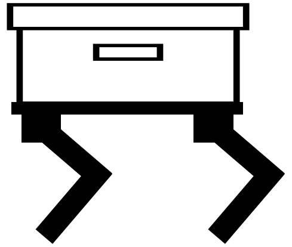

# ShoeBot 

&nbsp;
&nbsp;

## Table of Contents
- [Repository Structure](#repository-structure)
- [The Wiki](#the-wiki)
- [Module Descriptions](#module-descriptions)
- [Hardware](#hardware)
  - [Printed Components and Module Fit](#printed-components-and-module-fit)
  - [Custom PCB for SPI](#custom-pcb-for-spi)
- [Software](#software)
  - [Communication Protocol](#communication-protocol)
  - [Chip Select](#chip-select)
  - [Future development](#future-development)
- [FAQ](#faq)
- [License](#license)

## Repository Structure
- `/hardware/` – STL and STEP files for 3D printing
- `/software/` – Code for the centralized controller, example firmware for modules, and hardware test scripts
- `/docs/` – Quick-start guide and printing instructions, additional reference material as it becomes available (PDF)
- `/images/` – Holds images used in this README, as well as some others throughout the repository
- `README.md` – You are here.

## The Wiki
Documentation for this project, including: 

- Part orientation and printer setting recommendations
- Assembly instructions
- Calibration and hardware validation protocols
- System-level descriptions
- and more

are being migrated to the [project wiki](https://www.github.com/tyler-bartunek/ShoeBot/wiki) for ease of access
and navigation purposes. There's a lot that goes into this system, and it is only fitting that worthy documentaion
would be quite extensive, requiring a wiki to track it all. 

## Module Descriptions

1. Wheels: This module consists of DC motors and mecanum wheels, represents minimal functional example.
2. Shoeshine: Offers quadrupedal motion through use of servomotors
3. HexaBox: Requires six mounts, offers six-legged locomotion through use of servomotors.

## Hardware

### Printed Components and Module Fit
Both STEP and STL files for all components to be printed are provided under the hardware directory, with directions for
the base hardware and wheels module provided in the Quick-Start Guide. As modules are added, printing directions specific
to those modules will be added to the docs directory. This system was prototyped using an Ender 3 V2 and Cura slicer using 
PLA+, with dimensions set to reflect typical tolerances for that printer with the intent of clearance fits with minimal play between 
mounting rails and modules. Nominal ridge width for the rail channels is 8 mm, but for the described printer setup a 7.8 mm 
width with 8.2 mm gap between ridges was found to provide the desired fit. 

### Custom PCB for SPI
KiCad files for an optional custom PCB for fanning out the SPI communication are included, from which you can modify/augment the design
and generate your own gerber files for production. Validation for this design is still ongoing, use at modest speeds and
keep the wires to each module the same length. Note that while the design uses JST 2.5 mm pitch connectors for wire connections,
due to clearance issues with the raspberry pi standoffs it is recommended to just solder the wires in directly.

## Software

### Communication Protocol
This system presently communicates with locomotion hardware modules over SPI to facilitate both high-speed transactions
for configurations where that matters as well as ease of identifying module configurations and approximate layout. Included 
as an optional component are the schematic and KiCad board file for a PCB that handles fanning out the SPI communication.

#### Chip Select 
To make this simpler, an SPI_Fanout class is under development. While we wait for that to finish, here's the breakdown
of design intent for the fanout board plus a few practical tips.

In order to free up GPIO pins on the Raspberry Pi, it uses an 8-bit shift register to toggle chip select pins for each of
the modules. On the optional PCB, this register is a 74HC595, and the following values correspond to the 
following locations:

1. Back Left: 0x7F
2. Center Left: 0xBF
3. Front Left: 0xDF
4. Front Right: 0xEF
5. Center Right: 0xF7
6. Back Right: 0xFB

If these values seem strange, it is because we are assuming **active-low** chip select, and these values ensure that the proper
pin is low while all others are high. The easy way to sanity-check if the byte you are sending is correct is to figure out which 
line you want to set low, figure out the binary value (in the case of the back-left connection, that would be 0x80), then invert.

Also, this PCB assumes that the register is using SCK from the SPI bus to handle its shift-in clock. For that reason, it was
necessary to deploy pigpio to set up an event listener on the SCK pin to detect the rising edge and send the each bit of that data on 
that rising edge.

#### Future development
Much of the firmware is still under development, and additional details such as component IDs, synchronization, and timing
requirements will be made available as that firmware is finalized. 

## FAQ

1. Why shoeboxes?

>I had originally set out to make what essentially amounts to just the wheels module as a CAD and mechatronic portfolio piece.
Seeking to understand the design considerations, I started to immerse myself in literature surrounding mecanum wheel devices 
and discovered something that is in hindsight self-evident: different design decisions like the wheel spacing and orientation 
fundamentally alters the dynamics of the system and therefore influence control. Creating modular systems to explore the impact 
of these parameters was largely underexplored in what I found, so I set out to make my own. But I needed a good frame. Something
cheap and easy to deploy. As I looked around me, I saw an unused shoebox. And the ShoeBot system was born. 

>Realistically any cardboard box will work, but at the time a shoebox seemed like the right size for what I set out to accomplish.

2. Why didn't you use \<insert fastener here\> to fasten the modules to the box?

>In the early days, I explored a number of different means for mounting the hardware to the box. The current design for mounting
hardware to the box solves two problems simultaneously: the first is that of establishing a secure connection with minimal
assembly complexity, the second is offering a path for routing the wires from inside the box to the modules on the outside.

3. Doesn't the act of cutting into the box limit the reusability of a single box to test multiple design parameters?

>Yes, as do other adhesives that have enough strength to reliably anchor the hardware to the outside of the box. 

## License
This project is licensed under the terms of the [MIT License](LICENSE), which permits use, modification, and redistribution 
of the software in this repository.

If you build upon or share this work, please provide appropriate attribution and link back to this repository so others can 
benefit from and contribute to the project.
